# Intelligent Freight Invoice Analyzer

An AI-powered system that automatically verifies freight invoices, detects pricing anomalies, and makes intelligent decisions about whether to approve, review, or reject invoices.

## What This Does

This system helps companies automatically verify freight invoices by:

- **Detecting Anomalies**: Identifies invoices that are significantly different from expected costs
- **Understanding Context**: Analyzes why prices might be higher (express service, peak season, fuel prices, etc.)
- **Making Decisions**: Automatically approves, flags for review, or rejects invoices based on analysis
- **Providing Explanations**: Explains every decision with clear reasoning and recommendations

## 🚀 Quick Start

### Prerequisites

- Python 3.9+
- LangGraph CLI installed
- OpenAI API key (or compatible LLM provider)

### Installation

1. **Clone the repository**
   ```bash
   git clone <repository-url>
   cd intelligent-freight-invoice-analyzer
   ```

2. **Install dependencies**
   ```bash
   cd langgraph
   pip install -r requirements.txt
   ```

3. **Set up environment variables**
   ```bash
   cp .env.example .env
   # Edit .env and add your API keys
   ```

4. **Run the agent**
   ```bash
   langgraph dev
   ```

The agent will be available at `http://localhost:2024`

## 📊 How It Works

### High-Level Flow


### Processing Steps

1. **Validation**: Checks invoice structure and basic business rules
2. **Cost Calculation**: Calculates expected cost based on distance, weight, and service type
3. **Anomaly Detection**: Compares invoice against expected cost and historical data
4. **Context Analysis**: Uses AI to understand why anomalies exist (express service, seasonal factors, etc.)
5. **Decision Making**: Determines whether to approve, review, or reject based on confidence score
6. **Recommendations**: Provides actionable recommendations for each decision

### Decision Logic

```mermaid
graph TD
    A[Analysis Complete] --> B{Confidence Score}
    B -->|≥ 0.85| C[APPROVED<br/>Auto-approve invoice]
    B -->|0.40 - 0.85| D[REQUIRES REVIEW<br/>Send to review queue]
    B -->|< 0.40| E[REJECTED<br/>Reject and escalate]
```



**Confidence Score Meaning:**
- **High (0.85-1.0)**: Confident the invoice is justified → Approve
- **Medium (0.40-0.85)**: Uncertain → Requires human review
- **Low (0.0-0.40)**: Confident the invoice is unjustified → Reject

## 📁 Project Structure

```
intelligent-freight-invoice-analyzer/
├── langgraph/
│   ├── __init__.py          # Main agent implementation
│   ├── requirements.txt     # Python dependencies
│   ├── langgraph.json       # LangGraph configuration
│   └── test_cases.json      # Test scenarios
└── README.md                # This file
```

## 🔧 Configuration

### Environment Variables

Create a `.env` file in the `langgraph` directory:

```env
OPENAI_API_KEY=your_api_key_here
# Or use your LLM provider
```

### LangGraph Configuration

The `langgraph.json` file configures the agent:

```json
{
  "graphs": {
    "invoice_analyzer": "__init__:graph"
  },
  "env": ".env"
}
```

## 🧪 Testing

### Test Scenarios

1. **Normal Invoice**: Small variance, should be approved
2. **Express Service**: Higher cost due to express service, should require review
3. **Suspicious Invoice**: High variance without justification, should be rejected

## 📝 Example Usage

### Input Format

```json
{
  "invoice_data": {
    "invoice_id": "INV-001",
    "carrier": "DHL Freight",
    "origin": "Berlin",
    "destination": "Munich",
    "weight_kg": 1200,
    "distance_km": 585,
    "invoice_amount": 1150,
    "service_type": "express",
    "shipment_date": "2024-11-06"
  },
  "historical_data": [
    {
      "invoice_id": "HIST-001",
      "carrier": "DHL Freight",
      "origin": "Berlin",
      "destination": "Munich",
      "weight_kg": 1200,
      "distance_km": 585,
      "invoice_amount": 750,
      "service_type": "standard"
    }
  ],
  "expected_cost": 750.50
}
```

### Output Format

```json
{
  "status": "requires_review",
  "confidence_score": 0.75,
  "anomalies": [
    {
      "type": "price_deviation",
      "severity": "high",
      "description": "Invoice +53.2% from expected cost"
    }
  ],
  "justified_anomalies": [
    "price_deviation: justified by express service premium"
  ],
  "reasoning": "The 53.2% variance is higher than a typical express premium but falls within the range expected when additional seasonal, fuel, and capacity surcharges are applied.",
  "recommendations": [
    "Manual review recommended - variance appears justified by service level",
    "Express service typically incurs 30-70% premium - verify this matches contract terms"
  ]
}
```

## 🎨 Key Features

### Intelligent Analysis

- **Multi-Step Reasoning**: Analyzes invoices through multiple stages
- **Contextual Understanding**: Considers seasonal, market, and service factors
- **Explainable AI**: Provides clear reasoning for every decision

### Robust Decision-Making

- **Confidence Scoring**: Quantifies uncertainty in decisions
- **Anomaly Detection**: Identifies statistical outliers
- **Justification Analysis**: Distinguishes justified vs suspicious anomalies

### Safety Features

- **Contradiction Detection**: Detects inconsistencies between reasoning and confidence
- **Error Handling**: Graceful fallbacks if AI analysis fails
- **Validation**: Multiple checks prevent errors

## 🔍 How Decisions Are Made

### Factors Considered


### Example Scenarios

**Scenario 1: Normal Invoice**
- Variance: +0.6%
- Anomalies: None
- Result: **Approved** (confidence: 0.95)

**Scenario 2: Express Service**
- Variance: +53.2%
- Justification: Express service premium
- Result: **Requires Review** (confidence: 0.75)

**Scenario 3: Suspicious Invoice**
- Variance: +139.8%
- Justification: None
- Result: **Rejected** (confidence: 0.25)

## 🛠️ Development

### Running Locally

```bash
# Start LangGraph development server
cd langgraph
langgraph dev

# The agent will be available at http://localhost:2024
```

### Testing the API

```bash
# Test with a specific test case
python test_api.py test_cases.json

# Or test with custom input
python test_api.py your_invoice.json
```

## 📚 Documentation

- **Business Logic Guide**: `BUSINESS_LOGIC_AND_DEMO_GUIDE.md`
- **Architecture**: `ARCHITECTURE_AND_BEST_PRACTICES.md`
- **Testing Guide**: `TESTING_GUIDE.md`
- **Validation Checklist**: `VALIDATION_CHECKLIST.md`

## 🤝 Contributing

1. Fork the repository
2. Create a feature branch (`git checkout -b feat/your-feature`)
3. Commit your changes (`git commit -m 'Add some feature'`)
4. Push to the branch (`git push origin feat/your-feature`)
5. Open a Pull Request

## 📄 License

This project is licensed under the MIT License.

## 🙏 Acknowledgments

- Built with [LangGraph](https://github.com/langchain-ai/langgraph)
- Uses [LangChain](https://github.com/langchain-ai/langchain) for LLM integration
- Inspired by LOXXTER's freight invoice verification needs

---

**Made with ❤️ for intelligent invoice processing**
