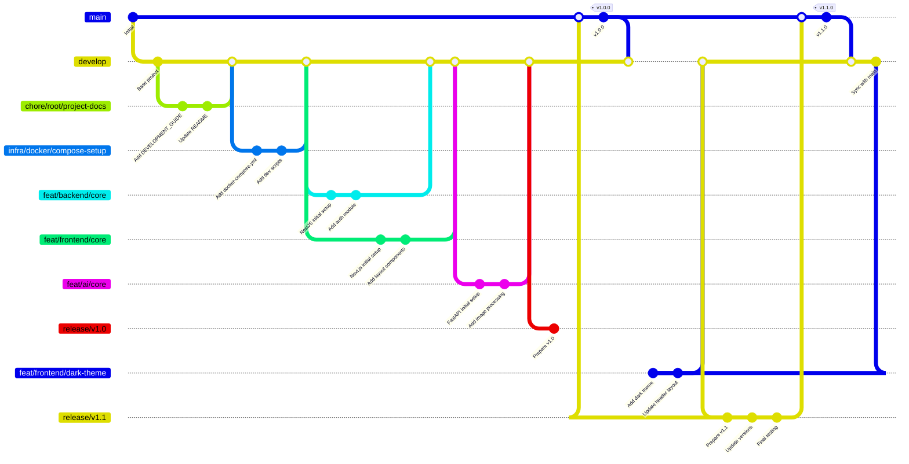

# Git Workflow and Conventions

## Branch Naming Convention

Use the format: `[type]/[service]/[short-description]`

**Types:**

- `feat/`: New features
- `fix/`: Bug fixes
- `chore/`: Maintenance tasks
- `docs/`: Documentation
- `refactor/`: Code improvements
- `infra/`: Infrastructure changes
- `ci/`: CI/CD pipelines
- `release/`: Version releases
- `hotfix/`: Critical production fixes

**Service Prefixes:**

- `frontend/`
- `backend/`
- `ai/`
- `db/`
- `infra/` (for Docker/compose)
- `scripts/`
- `root/` (repo-wide changes)

**Examples:**

- `feat/frontend/authentication-ui`
- `fix/backend/auth-bypass`
- `chore/ai/update-dependencies`
- `infra/docker-compose-dev-setup`
- `ci/github-actions-pipeline`
- `release/v1.0`
- `hotfix/security-patch`

## Commit Message Convention (Conventional Commits)

```
[type][(scope)]: [description]

[Body (optional)]

[Footer (optional)]
```

**Examples:**

```bash
feat(backend): add user authentication module

- Implemented JWT auth strategy
- Created user registration endpoint
- Added role-based access control

Closes #123
```

```bash
fix(ai): handle image processing edge cases

- Fixed memory leak in image preprocessing
- Added error handling for corrupt uploads
- Improved validation for image formats

Resolves #456
```

```bash
chore(root): update project documentation

- Updated DEVELOPMENT_GUIDE.md
- Added service diagrams to PROJECT_ORGANIZATION.md
- Fixed broken links in README
```

```bash
infra(docker): optimize dev container sizes

- Reduced backend container size by 40%
- Multi-stage builds for ai-service
- Shared common layers between services
```

```bash
release(root): version 1.0 baseline

- Merged initial full-stack setup from develop
- Includes frontend, backend, AI service, and PostgreSQL integration
- Adds dev launcher and service manager scripts
- Establishes documentation and workflow standards

Tag: v1.0.0
```

## Branch Strategy



## Service-Specific Commit Scopes

1. **Frontend**:
   - `feat(frontend/auth): login form`
   - `fix(frontend/upload): file validation`
   - `refactor(frontend/layout): responsive design`

2. **Backend**:
   - `feat(backend/users): CRUD operations`
   - `fix(backend/db): connection pooling`
   - `chore(backend): update NestJS to v10`

3. **AI Service**:
   - `feat(ai/models): disease detection`
   - `perf(ai/inference): optimize prediction`
   - `docs(ai): add model training guide`

4. **Database**:
   - `feat(db/migrations): add users table`
   - `fix(db/schema): relation constraints`

5. **Infrastructure**:
   - `infra(docker): add GPU support`
   - `chore(scripts): fix permissions`

## Pull Request Conventions

**Title Format:**  
`[Service] [Type]: Short Description`  
Example: `[Backend] [Feat]: Implement user authentication`

**Description Template:**

```markdown
## Summary
Brief description of changes

## Changes
- Change 1
- Change 2

## Impact
Affected services: [list services]

## Related Issues (if it exists)
Closes #123, Fixes #456

## Checklist
- [ ] Tests pass
- [ ] Documentation updated
- [ ] No breaking changes
```

## Version Release Workflow

Version releases follow a structured **release branch strategy** that ensures stability, traceability, and parallel development capabilities. This workflow separates release preparation from ongoing development work.

### Release Branching Strategy

| Branch Type | Purpose | Example |
|-------------|---------|---------|
| `develop` | Main development branch | `develop` |
| `release/vX.Y` | Release stabilization branches | `release/v1.1` |
| `main` | Production-ready code (protected) | `main` |
| `hotfix/` | Critical production fixes | `hotfix/security-patch` |

### Release Branch Workflow Process

#### 1. Create Release Branch from `develop`

When ready to prepare a new release:

```bash
# Ensure develop is up to date
git checkout develop
git pull origin develop

# Create release branch
git checkout -b release/v1.1
```

#### 2. Prepare Release in Release Branch

Update versioning and prepare release materials:

```bash
# Update version numbers in relevant files
# - package.json (frontend)
# - build.gradle (backend) 
# - requirements.txt (ai-service)
# - CHANGELOG.md (if maintained)

# Commit version updates
git add .
git commit -m "release(root): prepare v1.1.0"
```

#### 3. Push Release Branch and Create PR to `main`

```bash
# Push release branch
git push origin release/v1.1
```

Create a Pull Request: **`release/v1.1 → main`**

**PR Title Format:**  
`[Root] [Release]: Version X.Y – Summary of changes`

**PR Description Template:**

```markdown
## Summary
Release v1.1 includes [brief description of changes].

## Highlights
- [Key feature 1]
- [Key feature 2]
- [Infrastructure improvements]

## Impact
- [Impact on users/developers]
- [Breaking changes (if any)]

## Checklist
- [x] All services tested
- [x] Documentation updated (if applicable)
- [x] No breaking changes
- [x] Version numbers updated
- [x] Changelog updated
```

#### 4. Merge Release PR into `main`

- Use **merge commit** or **squash** (based on repo policy)
- This triggers production deployment pipeline 🚀

#### 5. Tag the Release

After successful merge to `main`:

```bash
# Switch to main and pull latest
git checkout main
git pull origin main

# Tag the release
git tag -a v1.1.0 -m "Version 1.1.0 – [Summary of changes]"
git push origin v1.1.0
```

#### 6. Sync `develop` with `main`

Merge the release back into `develop` to keep branches aligned:

```bash
# Switch to develop
git checkout develop
git pull origin develop

# Merge main into develop
git merge main
git push origin develop
```

#### 7. Clean Up Release Branch

```bash
# Delete local release branch
git branch -d release/v1.1

# Delete remote release branch
git push origin --delete release/v1.1
```

### Release Commit Convention

Use scoped commits for release preparation:

```bash
release(root): prepare v1.1.0

- Updated version numbers across all services
- Added new authentication features
- Improved error handling in AI service
- Updated documentation

Tag: v1.1.0
```

### Benefits of Release Branch Strategy

1. **Stabilization Phase**: Final testing and bug fixes without affecting ongoing development
2. **Version Management**: Clear place to update version numbers and changelogs
3. **Rollback Safety**: Fix issues in release branch before merging to main
4. **Parallel Development**: Development continues on `develop` during release preparation
5. **Clean History**: Maintains clean commit history in main branch
6. **Release Isolation**: Release-specific changes don't pollute main development flow

### Practical Release Example

Here's a complete example of releasing version 1.1 with dark theme and header updates:

```bash
# 1. Create release branch from develop
git checkout develop
git pull origin develop
git checkout -b release/v1.1

# 2. Update version numbers
# Update frontend/package.json: "version": "1.1.0"
# Update backend/build.gradle: version = '1.1.0'
# Update ai-service/requirements.txt if needed

# 3. Commit version updates
git add .
git commit -m "release(root): prepare v1.1.0

- Updated version numbers across all services
- Set dark theme as default UI theme
- Adjusted header/navigation to top of page
- Improved error handling in AI service

Tag: v1.1.0"

# 4. Push release branch
git push origin release/v1.1

# 5. Create PR: release/v1.1 → main
# PR Title: [Root] [Release]: Version 1.1 – Dark theme and header layout update
# PR Body: [Use template from above]

# 6. After PR is merged to main, tag the release
git checkout main
git pull origin main
git tag -a v1.1.0 -m "Version 1.1.0 – Dark theme & header layout"
git push origin v1.1.0

# 7. Sync develop with main
git checkout develop
git pull origin develop
git merge main
git push origin develop

# 8. Clean up release branch
git branch -d release/v1.1
git push origin --delete release/v1.1
```

### Hotfix Workflow (Alternative to Release Branch)

For critical production fixes that can't wait for the next release:

```bash
# 1. Create hotfix branch from main
git checkout main
git pull origin main
git checkout -b hotfix/security-patch

# 2. Make critical fix
git add .
git commit -m "fix(backend): patch security vulnerability in auth

- Fixed JWT token validation bypass
- Added additional input sanitization
- Updated security headers

Fixes #789"

# 3. Push and create PR to main
git push origin hotfix/security-patch
# Create PR: hotfix/security-patch → main

# 4. After merge, tag hotfix
git checkout main
git pull origin main
git tag -a v1.0.1 -m "Version 1.0.1 – Security patch"
git push origin v1.0.1

# 5. Merge back to develop
git checkout develop
git pull origin develop
git merge main
git push origin develop

# 6. Clean up
git branch -d hotfix/security-patch
git push origin --delete hotfix/security-patch
```

## Best Practices

1. **Atomic Commits**: Each commit should represent a single logical change
2. **Service Isolation**: Keep changes service-specific when possible
3. **Commit Message Verbs**: Use imperative mood ("Add" not "Added")
4. **Meaningful Descriptions**: Explain WHY, not just WHAT
5. **Reference Issues**: Always link to related issues/tickets
6. **Branch Cleanup**: Delete merged branches
7. **Regular Rebasing**: Rebase feature branches weekly
8. **Commit Signature**: GPG-sign important commits
